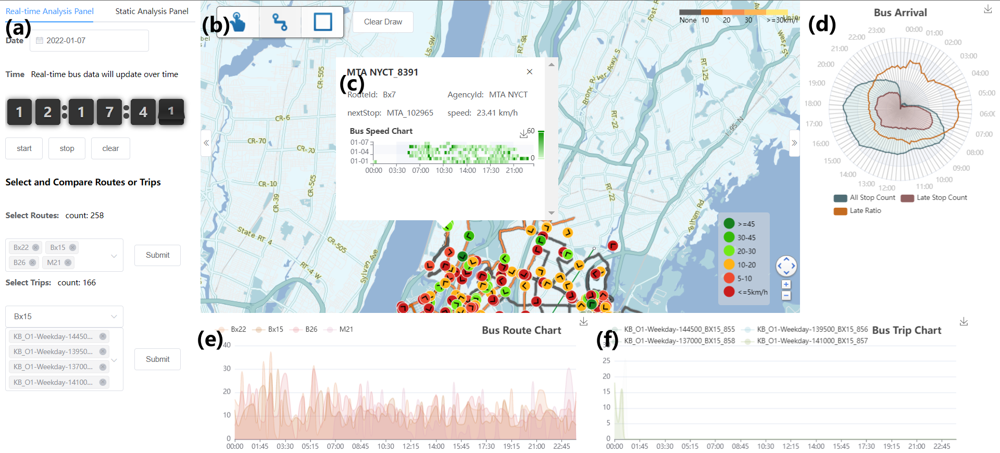
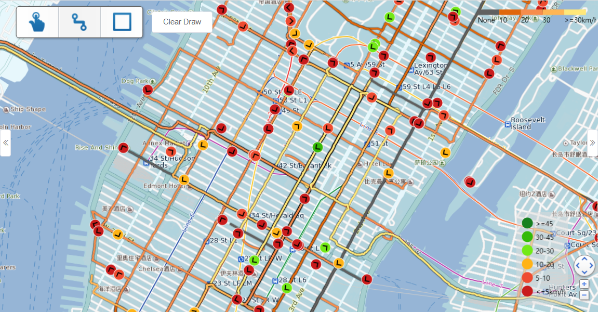

# transitnet-vue
A front-end of transit network visualization platform provides multi-view  interactive visualizations for in-depth exploration and mining of public transportation data.

## Visualization module
* Map view

* Radar view

* Heap map view

* Timeline view

## Getting started
### Configuration
Modify the back-end url and port based on your requirements.